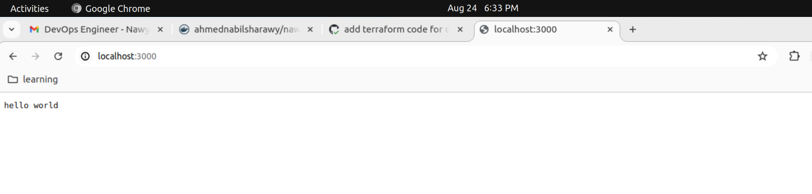

## CI Pipeline

This project's CI pipeline will be triggered automatically on any push to **master** branch

and the image tag will have the commit ID of the branch.

Docker Image will be stored on Dockerhub


## Deployment

Open the `@terraform` directory, update the `image_tag` variable with the required tag.


Run these commands in `@terraform` folder:

```bash
terraform init
terraform plan
terraform apply
```

## Screenshot of Result

